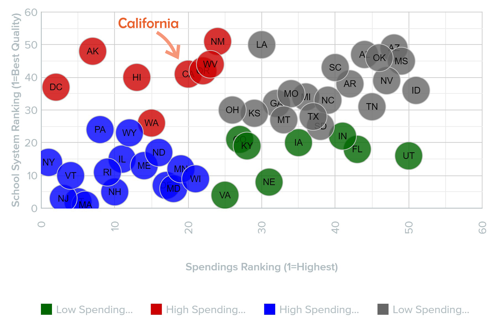
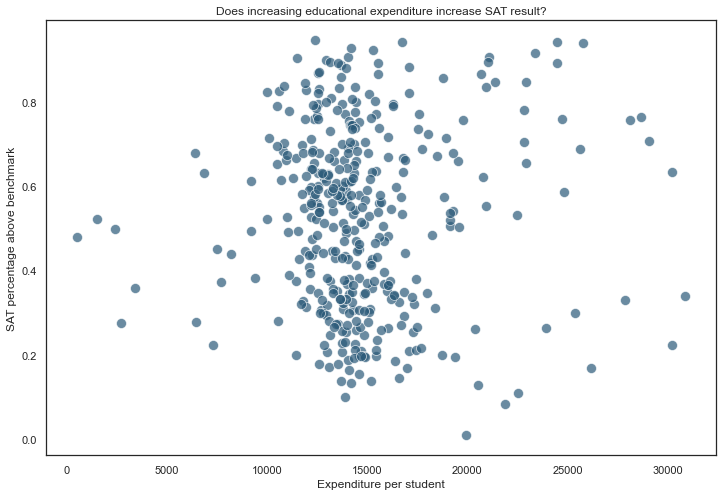
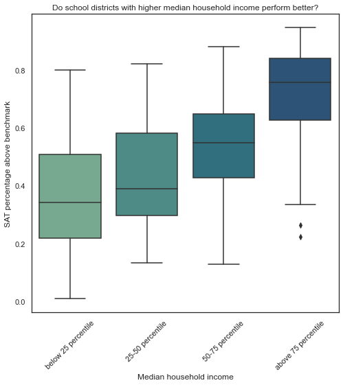
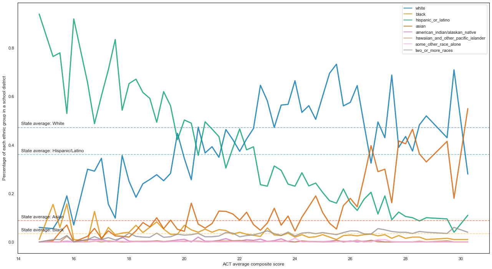
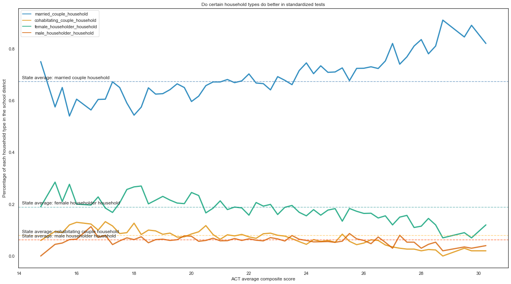
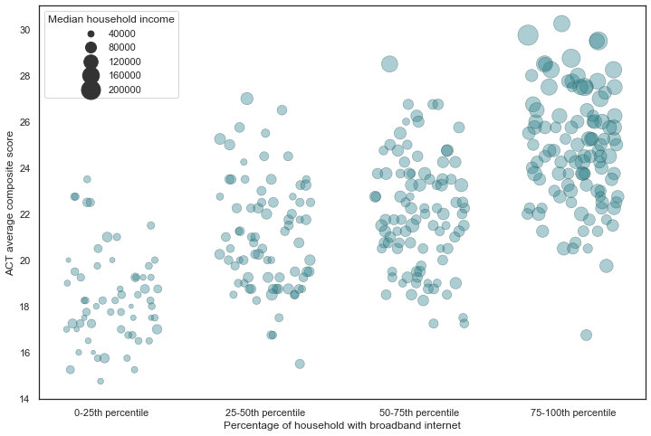
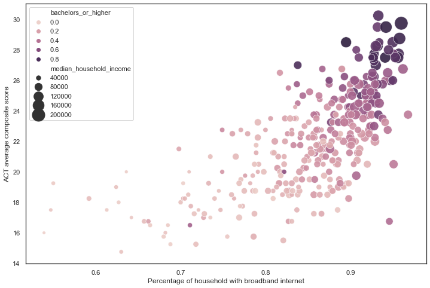
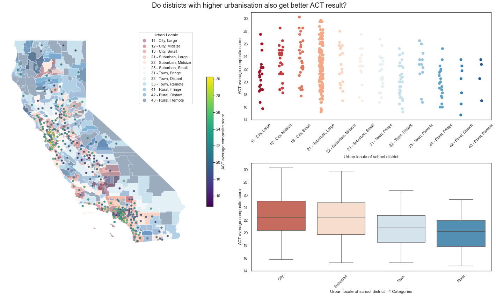

# Standardized Test Analysis

## Background

Despite being the technological powerhouse of United States and the 5th highest state in terms of GDP per capita, California seems to underperform when it comes to quality of pre-tertiary education. It ranks 40th in the quality of pre-K121 education ([usnews](https://www.usnews.com/news/best-states/rankings/education)) and 41th in quality of public schools ([wallethub](https://wallethub.com/edu/e/states-with-the-best-schools/5335)). This is not for the lack of education resources either, as the state ranks 20th in terms of education spending. There is therefore an inefficient utilisation of education spendings and an urgency to take a more targeted approach in terms of where and how the money is spent.

 

    <a href="https://wallethub.com/edu/e/states-with-the-best-schools/5335">Source</a>
 

### A little about SAT and ACT

The SAT and ACT are standardized tests that many colleges and universities in the United States require for their admissions process. This score is used along with other materials such as grade point average (GPA) and essay responses to determine whether or not a potential student will be accepted to the university.

The SAT has two sections of the test: Evidence-Based Reading and Writing and Math ([*source*](https://www.princetonreview.com/college/sat-sections)). The ACT has 4 sections: English, Mathematics, Reading, and Science, with an additional optional writing section ([*source*](https://www.act.org/content/act/en/products-and-services/the-act/scores/understanding-your-scores.html)). They have different score ranges, which you can read more about on their websites or additional outside sources (a quick Google search will help you understand the scores for each test):
* [SAT](https://collegereadiness.collegeboard.org/sat)
* [ACT](https://www.act.org/content/act/en.html)

Since the 1940's, an increasing number of colleges have been using scores from sudents' performances on tests like the SAT and the ACT as a measure for college readiness and aptitude ([*source*](https://www.minotdailynews.com/news/local-news/2017/04/a-brief-history-of-the-sat-and-act/)). Although the Covid-19 pandemic have promopted some US universities to make ACT or SAT non-mandatory for the 2020 admission cycle, they are making a comeback as normality resumes. 

Going to a college is still an important engine for social mobility, and going to a university is still correlated with higher earnings [Source](https://www.northeastern.edu/bachelors-completion/news/average-salary-by-education-level/). Given this, ACT and SAT are still important benchmarks for the education system.

## Problem Statement

The state of California has many school districts, with varying ACT and SAT performances. In order to improve the performances in these standardized tests, it is often not enough to just increase funding and resources to districts with poorer performances without identifying the underlying reasons behind the poor results.

This project aims to analyse the student performances on SAT and ACT tests with regards to a number of socio-economic indicators of each district. This helps to identify underlying factors which contributes to potential poor performances so that the state can take a more targeted approach in allocating funds and resources, as well as recommending interventions in areas of concern. 

- **Role taken on: Adviser for the state education budgeting office**
- **Target audience: Officials of the budgeting office**

## Datasets

To fulfill the objective of our analysis, we will use the following datasets:

**Datasets provided as part of project**
* [`act_2019_ca.csv`](data/act_2019_ca.csv): 2019 ACT Scores in California by School

* [`sat_2019_ca.csv`](/data/sat_2019_ca.csv): 2019 SAT Scores in California by School

**Datasets from other sources**
* [`california_school_district_info.csv`](/data/california_school_district_info.csv): 2018-2019 California School District information such as NCES ID (For referencing school districts on the NCES database), homelessness, dropout, suspension and other demographic/academic info

* [`california_school_district_NCES_info.csv`](/data/california_school_district_NCES_info.csv): additional socio-economic-demographic information about California school districts obtained from National Center for Education Statisitcs(NCES) database 
    * See the notebook for obtaining the data here: [`additional_data_scraping.ipynb`](code/additional_data_scraping.ipynb)

## Data Dictionary

| Feature                                     | Type    | Dataset                                      | Description      |
| ------------------------------------------- | ------- | -------------------------------------------- | -----------------|
| NCES\_ID                                    | int64   | california\_school\_district\_info.csv       | School district identifier for National Center for Education Statistics (NCES)                                                            |
| CDCode                                      | int64   | california\_school\_district\_info.csv       | Official school district Identifier                                                                                                       |
| county\_name                                | object  | california\_school\_district\_info.csv       | County name      |
| district\_name                              | object  | california\_school\_district\_info.csv       | School district name                                                                                                                      |
| district\_type                              | object  | california\_school\_district\_info.csv       | Type of school district                                                                                                                  |
| urban\_locale                               | object  | california\_school\_district\_info.csv       | Urban locale of school district (city, suburb, fringe, rural, etc)                                                                        |
| total\_enrolment                            | int64   | california\_school\_district\_info.csv       | Total student enrolment                                                                                                                 |
| charter\_school\_percentage                 | float64 | california\_school\_district\_info.csv       | Percentage of students in charter school                                                                                                |
| non\_charter\_school\_percentage            | float64 | california\_school\_district\_info.csv       | Percentage of students in non-charter school (Public)                                                                                   |
| homeless\_student\_percentage               | float64 | california\_school\_district\_info.csv       | Percentage of students who are homeless                                                                                                 |
| migrant\_student\_percentage                | float64 | california\_school\_district\_info.csv       | Percentage of students who are migrants                                                                                                 |
| dropout\_percentage                         | float64 | california\_school\_district\_info.csv       | Percentage of students who dropped out                                                                                                  |
| suspension\_percentage                      | float64 | california\_school\_district\_info.csv       | Percentage of students suspended                                                                                                        |
| total\_population                           | float64  | california\_school\_district\_NCES\_info.csv | Total population of district                                                                                                               |
| median\_household\_income                    | float64  | california\_school\_district\_NCES\_info.csv | Median houshold income of district                                                                                                        |
| total\_household                            | float64  | california\_school\_district\_NCES\_info.csv | Total household number of district                                                                                                        |
| white                                       | float64 | california\_school\_district\_NCES\_info.csv | Percentage of district population who are white                                                                                         |
| black                                       | float64 | california\_school\_district\_NCES\_info.csv | Percentage of district population who are black                                                                                         |
| hispanic\_or\_latino                        | float64 | california\_school\_district\_NCES\_info.csv | Percentage of district population who are hispanic\_or\_latino                                                                          |
| asian                                       | float64 | california\_school\_district\_NCES\_info.csv | Percentage of district population who are asian                                                                                         |
| american\_indian/alaskan\_native            | float64 | california\_school\_district\_NCES\_info.csv | Percentage of district population who are american indian/alaskan native                                                                |
| hawaiian\_and\_other\_pacific\_islander     | float64 | california\_school\_district\_NCES\_info.csv | Percentage of district population who are hawaiian and other pacific islanders                                                          |
| some\_other\_race\_alone                    | float64 | california\_school\_district\_NCES\_info.csv | Percentage of district population who are from other races                                                                              |
| two\_or\_more\_races                        | float64 | california\_school\_district\_NCES\_info.csv | Percentage of district population who are from or mores                                                                                 |
| housing\_structure\_built\_2000\_and\_after | float64 | california\_school\_district\_NCES\_info.csv | Percentage of houses built 2000 and after                                                                                               |
| housing\_structure\_built\_1970-1999        | float64 | california\_school\_district\_NCES\_info.csv | Percentage of houses built from 1970 to 1999                                                                                            |
| housing\_structure\_built\_before\_1970     | float64 | california\_school\_district\_NCES\_info.csv | Percentage of houses built before 1970s                                                                                                 |
| household\_with\_broadband\_internet        | float64 | california\_school\_district\_NCES\_info.csv | Percentage of households with internet broadband                                                                                        |
| housing\_structure\_type\_house             | float64 | california\_school\_district\_NCES\_info.csv | Percentage of district population who live in houses                                                                                    |
| housing\_structure\_type\_apartment         | float64 | california\_school\_district\_NCES\_info.csv | Percentage of district population who live in apartments                                                                                |
| speak\_english\_only\_children              | float64 | california\_school\_district\_NCES\_info.csv | Percentage of district population who speak english ony                                                                                 |
| under18\_with\_disability                   | float64 | california\_school\_district\_NCES\_info.csv | Percentage of students with disability                                                                                                  |
| under18\_with\_health\_insurance            | float64 | california\_school\_district\_NCES\_info.csv | Percentage of students with health insurance coverage                                                                                   |
| family\_income\_below\_poverty              | float64 | california\_school\_district\_NCES\_info.csv | Percentage of students with family income below poverty level                                                                           |
| married\_couple\_household                  | float64 | california\_school\_district\_NCES\_info.csv | Percentage of students who are from married couple households                                                                           |
| cohabitating\_couple\_household             | float64 | california\_school\_district\_NCES\_info.csv | Percentage of students who are from cohabitating couple households                                                                      |
| female\_householder\_household              | float64 | california\_school\_district\_NCES\_info.csv | Percentage of students who are from households with female householder only                                                             |
| male\_householder\_household                | float64 | california\_school\_district\_NCES\_info.csv | Percentage of students who are from households with male householder only                                                               |
| parents\_not\_in\_labor\_force              | float64 | california\_school\_district\_NCES\_info.csv | Percentage of students with parents not in labor force                                                                                  |
| bachelors\_or\_higher                       | float64 | california\_school\_district\_NCES\_info.csv | Pencentage of students with parents who possess at least a bachelor's degree                                                            |
| expenditure\_per\_student                   | float64 | california\_school\_district\_NCES\_info.csv | Expenditure per student of the school district                                                                                            |
| majority\_race                              | object | california\_school\_district\_NCES\_info.csv | The majority race of the district                                                                                                           |
| white\_majority                             | object | california\_school\_district\_NCES\_info.csv | Whether the majority race of the district is white                                                                                    |
| act\_enroll                                 | float64 | act\_2019\_ca.csv | Enrollment of Grade 12                      |
| act\_num\_test\_taker                       | float64 | act\_2019\_ca.csv                            | Number of Test Takers for ACT                                                                                                            |
| act\_participation\_rate                    | float64 | act\_2019\_ca.csv                            | Participation Rate of Grade 12 in ACT                                                                                                        |
| act\_average\_reading\_score                | float64 | act\_2019\_ca.csv                            | Average ACT Reading Score                                                                                                                      |
| act\_average\_english\_score                | float64 | act\_2019\_ca.csv                            | Average ACT  English Score                                                                                                                     |
| act\_average\_math\_score                   | float64 | act\_2019\_ca.csv                            | Average ACT Math Score                                                                                                                            |
| act\_average\_science\_score                | float64 | act\_2019\_ca.csv                            | Average ACT Science Score                                                                                                                      |
| act\_num\_above\_average\_score             | float64 | act\_2019\_ca.csv                            | Number of Test Takers Whose ACT Composite Scores Are Greater or Equal to 21.                                                                   |
| act\_percentage\_above\_average\_score      | float64 | act\_2019\_ca.csv                            | Percent of Test Takers Whose ACT Composite Scores Are Greater or Equal to 21                                                                   |
| sat\_enroll                                 | float64 | sat\_2019\_ca.csv                            | Enrollment of Grade 12 and Grade 11                                                                                                            |
| sat\_num\_test\_taker                       | float64 | sat\_2019\_ca.csv                            | Number of Test Takers for SAT                                                                                                                  |
| sat\_participation\_rate                    | float64 | sat\_2019\_ca.csv                            | Participation Rate of Grade 12 and 11 in ACT                                                                                                       |
| sat\_num\_erw\_benchmark                    | float64 | sat\_2019\_ca.csv                            | The number meeting the Evidence-Based Reading & Writing (ERW) benchmark established by the College Board based on the New 2016 SAT test format     |
| sat\_percentage\_erw\_benchmark             | float64 | sat\_2019\_ca.csv                            | The percent of students who met or exceeded the benchmark for Evidence-Based Reading & Writing (ERW) test                                      |
| sat\_num\_math\_benchmark                   | float64 | sat\_2019\_ca.csv                            | The number of students who met or exceeded the benchmark for the New SAT Math test format                                                      |
| sat\_percentage\_math\_benchmark            | float64 | sat\_2019\_ca.csv                            | The percent of students who met or exceeded the benchmark for SAT Math test                                                                    |
| sat\_num\_both\_benchmark                   | float64 | sat\_2019\_ca.csv                            | The total number of students who met the benchmark of both Evidence-Based Reading & Writing (ERW) and Math                                        |
| sat\_percentage\_both\_benchmark            | float64 | sat\_2019\_ca.csv                            | The percent of students who met the benchmark of both Evidence-Based Reading & Writing (ERW) and Mat                                           |

## Data preprocessing

**Merging data from different sources**

Data consists of:

ACT and SAT results:
* [`act_2019_ca.csv`](data/act_2019_ca.csv): 2019 ACT Scores in California by School

* [`sat_2019_ca.csv`](data/sat_2019_ca.csv): 2019 SAT Scores in California by School

These are the respective ACT and SAT results for all schools in the State of California, with rows for the aggregated district, county, and state level result. We will filter out only district level data for this project.

District level data on socio-economic info of each school district
* [`california_school_district_info.csv`](data/california_school_district_info.csv): 2018-2019 California School District information 
* [`california_school_district_NCES_info.csv`](data/california_school_district_NCES_info.csv): additional socio-economic-demographic information about California school districts 

These are additional district level socio-economic data obtained from National Center for Education Statastics website

As both sets of data consists of a column with NCES id, we use this as unique identifier to merge the two sets of dataframes 

**Data cleaning**

Data cleaning mainly consists of removing rows where the information of interest are not present. As well as changing datatypes from objects to numerical data types and categorical data types.

Some new variables such as score per dollar expenditure spent were also added as additional columns.

## Summary of Analysis

From the analysis, it was found that increasing education expenditure per student for district only has a limited impact in improving test scores for that district. 

 
 
A more correlated factor is the district's median household income.

A few other factors which has a correlation of more than 0.5 with standardized test scores were also identified. It was found that:

- Standardized test performance is divided along **ethnicity**, districts with more White Americans and especially Asian Americans tend to performing better than other groups. 

- Standardized test scores also tend to increase along with an increase in percentage of **married households**, the inverse is true for other household types such as cohabitating households, female householder and male householder households. 

- Districts with higher level of **access to broadband internet** tends to perform better in standardized tests, this highlights the importance of access to knowledge in helping students prepare for their tests

- Districts with a higher percentage of parents who have at least a bachelor's degree **education** also tend to be districts with higher test scores. See this in context with broadband access and median household income further highlights the division.

For all these factors, we also see a correlation with income as well, showing that inequity entrenches both academic as well as economic well-being. 

Perhaps the most obvious display of this inequity surfaces when we look at the **geographical distribution** of test scores and income, with cities and suburban areas scoring better in standardized tests than towns and rural area districts, coastal areas tend to score better than inland areas.

## Recommendation and Conclusion

The analysis allowed us to have a glimpse into the socio-economic division underlying the disparity in tests scores. We propose the following recommendations for different aspects of intervention: 

**Allocation of education expenditure:**
- More education expenditure should be allocated especially to those districts with less than 10,000 USD

**Economic:**
- Improving the economic well-being of an area is a long term endeavor. On the shorter term, more resources should be dedicated to lower income families

**Ethnic**:  
- More help should be focused on Hispanic/Latino as well as Black Americans
- A separate research can be conducted to investigate what Asian American families are doing right to achieve higher standardized score

**Broadband Access:**
- provide subsidized broadband services in order to lower then barrier of access to information and knowledge

**Household type:**
- Increase provision of career advice, counselling and after school care to districts with lower percentage of married households. 

**Geographical:**
- Focus help on town and rural areas, especially inland areas.

As unversity admission is still an important pathway to social mobility, it is crucial that the underlying divisions are addressed, so that standardized tests do not perpetuate the existing division in the society. 

---

**Footnotes**

1. In the US school system, pre-K12 education incudes kintergarden and up to 12th grade (pre-University)
